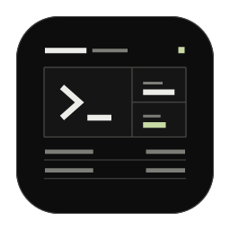

<h1> BrewPeek</h1>

**Homebrew로 설치한 패키지를 한눈에.**

BrewPeek는 Homebrew로 설치한 명령줄 도구와 앱을 살펴보는 macOS 앱입니다. 패키지 목록, 의존 관계, 디스크 사용량을 하나의 창에서 확인하며 개발 환경을 파악하고 설치된 패키지를 정리하기 전에 살펴볼 수 있습니다.

[English manual](README.md)

## 시작하기

Mac에 Homebrew가 설치되어 있다면 `BrewPeek.app`을 실행하세요. 저장된 목록이 있으면 먼저 표시하고 최신 정보를 확인합니다. 처음 실행할 때는 설치 정보를 수집한 뒤 목록이 표시됩니다.

1. 상단 요약에서 전체 설치 현황을 확인합니다.
2. 검색과 필터로 원하는 패키지를 찾습니다.
3. 패키지 행을 눌러 상세 정보를 펼칩니다.
4. Homebrew 설치 상태가 바뀌면 **Refresh** 버튼으로 갱신합니다.

## 설치 현황 읽기

화면 상단의 숫자는 현재 설치 상태를 요약합니다.

| 항목 | 의미 |
|---|---|
| Installed | 설치된 Formula와 Cask의 총 개수 |
| Formulae | 명령줄 도구·라이브러리 등 Formula 패키지 |
| Casks | 앱·폰트 등 Cask로 설치된 패키지 |
| Leaves | Homebrew가 Leaf로 분류한 Formula로, 의존 관계를 살펴볼 때 출발점으로 활용할 수 있는 항목 |
| Taps | 추가로 등록한 Homebrew 패키지 저장소 |

요약 아래에서는 직접 설치 요청한 Formula 개수와 Cellar 사용량도 확인할 수 있습니다. Cellar는 Homebrew가 Formula 설치 파일을 보관하는 위치입니다.

## 패키지 검색과 정렬

**Search packages...** 에 이름이나 설명을 입력해 패키지를 찾습니다. **All categories**에서 카테고리를 선택하면 범위를 좁힐 수 있습니다. 검색어, 카테고리, 아래 필터는 함께 적용됩니다.

| 필터 | 표시하는 항목 |
|---|---|
| All | 설치된 전체 패키지 |
| Updates | 새 버전이 있는 패키지. 대상이 있을 때만 개수와 함께 표시 |
| Formula | Formula 패키지 |
| Cask | Cask 패키지 |
| Leaf | Leaf로 분류된 Formula |
| Dependency | Leaf로 분류되지 않은 Formula |
| Direct | 직접 설치 요청한 것으로 기록된 Formula |

Updates에는 Formula와 Cask가 함께 표시됩니다. 새로고침 후 업데이트 대상이 없어지면 필터가 사라지고, Updates를 선택 중이었다면 All로 돌아갑니다.

**Direct**는 설치 요청 여부, **Leaf**는 의존 관계에 따른 상태입니다. 하나의 Formula에 두 표시가 함께 나타날 수 있습니다.

표 머리글의 **Name**, **Version**, **Status**를 누르면 해당 기준으로 정렬합니다. 같은 항목을 다시 누르면 정렬 방향이 바뀝니다. Status 정렬은 Formula 목록에서 사용할 수 있습니다. 목록을 아래로 내려도 해당 섹션의 제목과 정렬 항목은 상단에 유지됩니다.

## 패키지 상세 정보

패키지 행을 누르면 상세 정보가 펼쳐지고, 다시 누르면 접힙니다.

**Version** 열에는 설치된 버전이 표시됩니다. Homebrew가 업데이트 대상으로 판단한 패키지는 그 아래에 작은 **Available: 새 버전** 문구가 나타납니다.

상세 화면에서는 다음 정보를 확인할 수 있습니다.

- **Category / Install origin** — 패키지 카테고리와 Formula의 직접 설치 요청 여부
- **Homepage / Source tap** — 프로젝트 홈페이지와 패키지를 제공하는 저장소
- **Dependencies** — 해당 패키지가 사용하는 의존 패키지
- **Used by · Installed formulae** — 해당 패키지를 사용하는 설치된 Formula
- **Disk usage / Installed path** — Homebrew 설치 파일의 용량과 경로
- **Actual app** — 앱 번들이 있는 Cask에서 확인한 실제 앱의 버전·경로·용량

Cask는 Homebrew 설치 정보와 실제 앱 번들 정보를 나누어 표시합니다. 따라서 Caskroom의 설치 기록과 앱 자체의 상태를 각각 확인할 수 있습니다.

## 패키지 업데이트

패키지 버전 옆의 **Update**로 개별 업데이트를, **Refresh** 왼쪽의 **Update all**로 업데이트 가능한 패키지 전체를 업데이트합니다. Update all은 업데이트 대상이 있으면 현재 선택한 필터와 관계없이 표시됩니다.

먼저 Homebrew에서 변경 사항을 확인합니다. 확인 창의 **Current / New** 열에서 기존 버전과 새 버전을 비교할 수 있으며, 함께 변경되는 의존성도 표시됩니다. 관계를 확인할 수 있는 항목에는 **Required by** 또는 **Uses**로 함께 포함된 이유를 표시합니다. 새로 설치할 의존성의 Current에는 **Not installed**가 표시됩니다. 목록을 확인한 뒤 **Update**를 누르면 시작합니다.

다운로드와 설치 순서는 Homebrew가 관리합니다. 진행 영역에서 처리한 패키지 수와 현재 작업을 확인하고, **Package details** 또는 **Show activity**를 펼쳐 자세히 볼 수 있습니다. 작업이 끝날 때까지 BrewPeek를 열어 두세요.

완료 후 실제 설치 버전을 확인해 결과를 표시하고 목록을 갱신합니다. 실패하거나 건너뛴 항목은 다시 시도할 수 있습니다. 실행 중인 앱은 종료한 뒤 업데이트하세요. 관리자 권한이 필요한 경우 **View Terminal command**에서 명령을 확인해 Terminal에서 실행하고, BrewPeek로 돌아와 새로고침합니다.

## 환경 정보 확인

**Environment**에서는 Homebrew 설치 경로와 버전, Mac 아키텍처, macOS 버전, Cellar와 Caskroom의 사용량을 확인합니다. **Additional taps**에는 Homebrew에 추가로 등록한 패키지 저장소가 표시됩니다.

## 새로고침과 데이터 저장

BrewPeek는 실행할 때 저장된 목록을 먼저 보여주고, Homebrew의 패키지 정보와 업데이트 판단 기준에 따라 최신 설치 정보와 새 버전을 확인합니다. 갱신 중에도 목록 검색과 상세 정보 확인은 가능하며, 업데이트 버튼은 확인이 끝난 뒤 활성화됩니다. Homebrew로 패키지를 설치·업데이트·삭제했다면 **Refresh** 버튼으로 다시 수집하세요. 새로고침 중에도 기존 화면을 유지하며 검색 조건, 정렬, 펼친 항목과 읽던 위치를 유지합니다. 화면 하단에는 현재 표시 중인 정보의 수집 시각이 나타납니다. 갱신에 실패하면 저장된 목록과 실패 상태를 표시하며, **Refresh**로 다시 시도할 수 있습니다.

최신 설치 정보는 다음 위치에 저장됩니다.

```text
~/Library/Application Support/BrewPeek/inventory.json
```

새로고침할 때마다 저장된 정보를 최신 상태로 교체합니다.

## BrewPeek 제거

상단 **BrewPeek** 앱 메뉴에서 **BrewPeek 제거…** 를 선택합니다. 확인 창에서 **휴지통으로 이동**을 누르면 앱과 저장 데이터가 휴지통으로 이동합니다. Homebrew로 설치한 패키지는 
그대로 유지됩니다.
