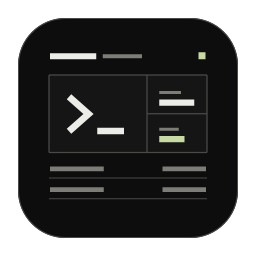
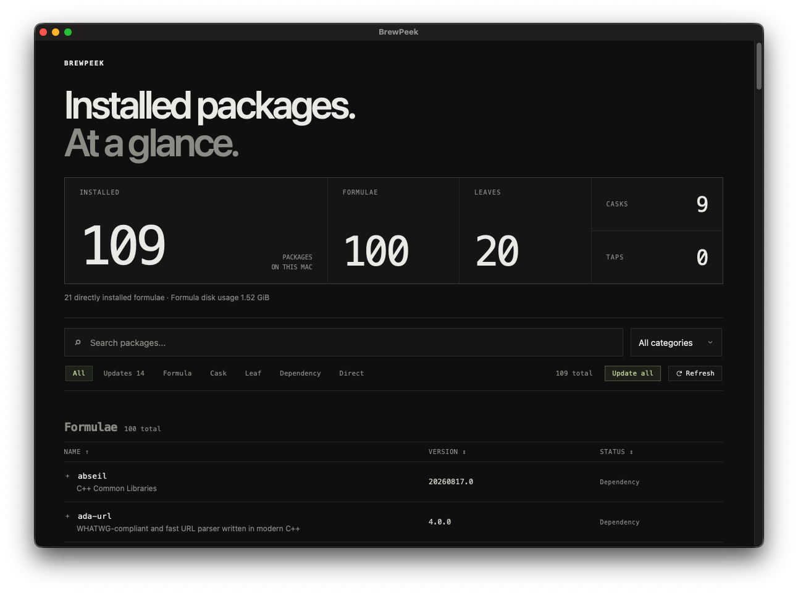

<h1> BrewPeek</h1>

**Homebrew로 설치한 패키지를 한눈에.**

BrewPeek는 Homebrew로 설치한 패키지를 확인하고 관리하는 macOS 앱입니다. 하나의 창에서 패키지 목록, 의존 관계, 디스크 사용량을 살펴보고 패키지 업데이트·삭제와 구버전 정리를 진행할 수 있습니다.

[English manual](README.md)



## 시작하기

Homebrew가 설치된 Apple Silicon Mac에서 사용할 수 있습니다. [GitHub Releases](https://github.com/kameronkim/brewpeek/releases)에서 BrewPeek를 내려받아 압축을 풀고 `BrewPeek.app`을 실행하세요. 처음 실행할 때는 설치 정보를 수집한 뒤 목록이 표시됩니다.

1. 상단 요약에서 전체 설치 현황을 확인합니다.
2. 검색과 필터로 원하는 패키지를 찾습니다.
3. 패키지 행을 눌러 상세 정보를 펼칩니다.
4. BrewPeek 외부에서 패키지를 변경했다면 **Refresh**로 갱신합니다.

앱 메뉴, 로딩 안내, 기본 대화상자는 macOS 언어 설정에 따라 한국어 또는 영어로 표시됩니다. BrewPeek에 별도로 지정한 앱별 언어 설정도 따릅니다. 패키지 목록 화면은 영어로 표시됩니다.

## 설치 현황 읽기

화면 상단의 숫자는 현재 설치 상태를 요약합니다.

| 항목 | 의미 |
|---|---|
| Installed | 설치된 Formula와 Cask의 총 개수 |
| Formulae | 명령줄 도구·라이브러리 등 Formula 패키지 |
| Casks | 앱·폰트 등 Cask로 설치된 패키지 |
| Leaves | Homebrew가 Leaf로 분류한 Formula로, 의존 관계를 살펴볼 때 출발점으로 활용할 수 있는 항목 |
| Taps | 추가로 등록한 Homebrew 패키지 저장소 |

요약 아래에서는 직접 설치 요청한 Formula 개수와 Cellar 사용량도 확인할 수 있습니다. Cellar는 Homebrew가 Formula 설치 파일을 보관하는 위치입니다.

## 패키지 검색과 필터

**Search packages...** 에 이름이나 설명을 입력해 패키지를 찾습니다. **All categories**에서 카테고리를 선택하면 범위를 좁힐 수 있습니다. 검색어, 카테고리, 아래 필터는 함께 적용됩니다.

| 필터 | 표시하는 항목 |
|---|---|
| All | 설치된 전체 패키지 |
| Updates | 새 버전이 있는 패키지. 대상이 있을 때만 개수와 함께 표시 |
| Formula | Formula 패키지 |
| Cask | Cask 패키지 |
| Leaf | Leaf로 분류된 Formula |
| Dependency | Leaf로 분류되지 않은 Formula |
| Direct | 직접 설치 요청한 것으로 기록된 Formula |

Updates에는 Formula와 Cask가 함께 표시됩니다. 새로고침 후 업데이트 대상이 없어지면 필터가 사라지고, Updates를 선택 중이었다면 All로 돌아갑니다.

**Direct**는 설치 요청 여부, **Leaf**는 의존 관계에 따른 상태입니다. 하나의 Formula에 두 표시가 함께 나타날 수 있습니다.

## 패키지 상세 정보

목록의 버전과 라벨은 다음을 의미합니다.

| 표시 | 의미 |
|---|---|
| Version | 설치된 버전 |
| Available | Homebrew가 업데이트 대상으로 판단한 패키지의 새 버전 |
| DEPRECATED | Homebrew에서 사용 중단 예정으로 표시한 패키지 |

패키지 행을 누르면 아래 상세 정보가 펼쳐지고, 다시 누르면 접힙니다.

| 항목 | 내용 |
|---|---|
| Category / Install origin | 패키지 카테고리와 Formula의 직접 설치 요청 여부 |
| Homepage / Source tap | 프로젝트 홈페이지와 패키지를 제공하는 저장소 |
| Dependencies | 해당 패키지가 사용하는 의존 패키지 |
| Used by · Installed formulae | 해당 패키지를 사용하는 설치된 Formula |
| Disk usage / Installed path | Homebrew 설치 파일의 용량과 경로 |
| Actual app | 앱 번들이 있는 Cask에서 확인한 실제 앱의 버전·경로·용량 |

Cask는 Homebrew 설치 정보와 실제 앱 번들 정보를 나누어 표시합니다. 따라서 Caskroom의 설치 기록과 앱 자체의 상태를 각각 확인할 수 있습니다.

## 패키지 업데이트

패키지 버전 옆의 **Update**로 개별 업데이트를, **Refresh** 왼쪽의 **Update all**로 업데이트 가능한 패키지 전체를 업데이트합니다. Update all은 업데이트 대상이 있으면 현재 선택한 필터와 관계없이 표시됩니다.

먼저 Homebrew에서 변경 사항을 확인합니다. 확인 창의 **Current / New** 열에서 기존 버전과 새 버전을 비교할 수 있으며, 함께 변경되는 의존성도 표시됩니다. 관계를 확인할 수 있는 항목에는 **Required by** 또는 **Uses**로 함께 포함된 이유를 표시합니다. 새로 설치할 의존성의 Current에는 **Not installed**가 표시됩니다. 실행 중인 앱은 종료하고, 목록을 확인한 뒤 **Update**를 누르면 시작합니다.

다운로드와 설치 순서는 Homebrew가 관리합니다. 작업이 끝날 때까지 BrewPeek를 열어 두세요.

업데이트나 삭제 중 Homebrew에 관리자 권한이 필요하면 BrewPeek의 보안 입력창에서 macOS 계정 비밀번호를 요청합니다. 비밀번호는 저장하지 않습니다.

## 패키지 삭제와 구버전 정리

패키지 상세 정보의 **Uninstall**로 Cask와 직접 설치한 Formula를 삭제할 수 있습니다. 패키지와 함께 정리할 불필요한 의존성을 확인한 뒤 진행합니다. 공유 의존성과 직접 설치한 의존성은 유지됩니다.

여러 버전이 설치된 Formula는 **Manage versions**에서 정리할 구버전을 선택할 수 있습니다. 삭제 가능 여부는 Homebrew의 기준을 따르며, 사용 중이거나 다른 패키지에 필요한 버전은 유지됩니다. 이 작업에서는 패키지 캐시와 의존성을 삭제하지 않습니다.

## 환경 정보 확인

**Environment**에서는 Homebrew 설치 경로와 버전, Mac 아키텍처, macOS 버전, Cellar와 Caskroom의 사용량을 확인합니다. **Additional taps**에는 Homebrew에 추가로 등록한 패키지 저장소가 표시됩니다.

## 새로고침과 데이터 저장

BrewPeek는 실행할 때 저장된 목록을 먼저 보여주고, Homebrew의 판단 기준에 따라 최신 설치 정보와 업데이트 가능 여부를 확인합니다.

BrewPeek 외부에서 패키지를 변경했다면 **Refresh**로 갱신하세요. 화면 하단에는 현재 표시 중인 정보의 수집 시각이 나타납니다.

최신 설치 정보는 다음 위치에 저장됩니다.

```text
~/Library/Application Support/BrewPeek/inventory.json
```

새로고침할 때마다 저장된 정보를 최신 상태로 교체합니다.

## BrewPeek 제거

상단 **BrewPeek** 앱 메뉴에서 **BrewPeek 제거…** 를 선택합니다. 확인 창에서 **휴지통으로 이동**을 누르면 앱과 저장 데이터가 휴지통으로 이동합니다. Homebrew로 설치한 패키지는 그대로 유지됩니다.
